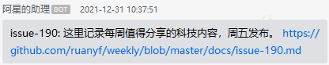

<!-- START doctoc generated TOC please keep comment here to allow auto update -->
<!-- DON'T EDIT THIS SECTION, INSTEAD RE-RUN doctoc TO UPDATE -->
**Table of Contents**  *generated with [DocToc](https://github.com/thlorenz/doctoc)*

- [ruanyf-weekly-rss-push](#ruanyf-weekly-rss-push)
  - [使用说明](#%E4%BD%BF%E7%94%A8%E8%AF%B4%E6%98%8E)
  - [效果图](#%E6%95%88%E6%9E%9C%E5%9B%BE)
  - [致谢](#%E8%87%B4%E8%B0%A2)

<!-- END doctoc generated TOC please keep comment here to allow auto update -->

## ruanyf-weekly-rss-push

基于 GitHub Actions 实现科学爱好者周刊 RSS feed 推送服务，支持推送到 Slack 和企业微信。

### 使用说明

1. Fork 此仓库到你的账户
2. 在仓库的 Settings -> Secrets and Variables -> Actions 中添加以下密钥：
   - `SLACK_URL`: Slack Webhook URL（如需推送到 Slack）
   - `WECOM_URL`: 企业微信 Webhook URL（如需推送到企业微信）
3. GitHub Actions 会自动按照预设时间运行检查并推送更新

### 效果图

### 致谢

- [ruanyf/weekly](https://github.com/ruanyf/weekly) [issue-190](https://github.com/ruanyf/weekly/issues/2132)
